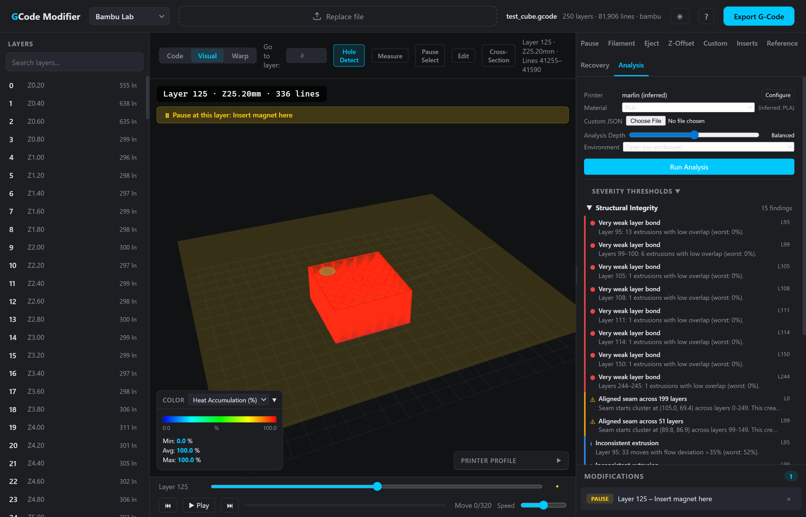
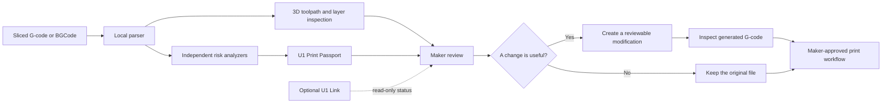
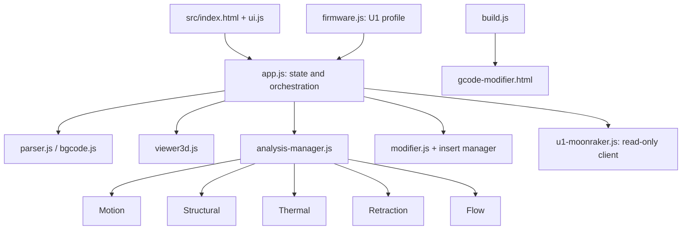

# ProofPrint U1

> **A local, explainable preflight workbench for Snapmaker U1 G-code.**

ProofPrint U1 gives makers a clear answer to the question that matters just before a long print: *what in this file deserves attention before material and machine time are committed?*

It reads the sliced G-code itself—not merely the model—and turns it into an interactive 3D inspection, a set of explainable risk findings, and a concise **U1 Print Passport**. The result is a practical review layer between slicing and printing: local by default, transparent about its assumptions, and deliberately controlled by the maker.



*Toolpath analysis workspace: 3D layer context, heatmap overlay, finding list, and a reviewable pause are shown together.*

## The problem

Complex U1 jobs compress many decisions into one file: material behavior, cooling, flow, geometry, retraction, motion, and points where a maker may need to intervene. A slicer preview can show where the tool will travel, but it does not always make the *consequences* of that travel easy to inspect.

ProofPrint U1 approaches that gap from the G-code outward. It makes the path, the layer context, and the relevant risk visible before a file reaches the printer. It is not another slicer, firmware replacement, cloud service, or autonomous print controller. It is a local planning and review workbench.

## What makers can do

| Capability | What it enables |
| --- | --- |
| G-code and BGCode import | Inspect the actual machine instructions locally in the browser. |
| 3D toolpath workspace | Navigate layers, play back moves, inspect cross-sections, measure features, compare revisions, and read heatmaps. |
| Risk analysis | Surface motion, structural, thermal, retraction, cooling, and volumetric-flow findings with context. |
| U1 Print Passport | See an advisory readiness score with explicit critical, warning, and informational counts. |
| Reviewable modifications | Add pauses, Z offsets, fan profiles, recovery helpers, custom G-code, and pressure-advance output with previewable changes. |
| U1 Link | Check local U1/Moonraker state and available toolheads without gaining printer-control capability. |

## From file to decision



The system intentionally ends at informed review. It does not send print commands, move hardware, set temperatures, upload files, or bypass a printer safety mechanism.

## Explainable by design

The U1 Print Passport is not a verdict about whether a print will succeed. It is an advisory summary of the findings produced from the loaded file. Each severity count is visible, and the surrounding tools let a maker inspect the relevant layer and toolpath before taking action.

That distinction matters. Material, nozzle, firmware configuration, enclosure conditions, and slicer settings are real-world variables. ProofPrint U1 makes its analysis useful without presenting a heuristic as certainty.

## A conservative U1 workflow

The included U1 profile is tailored to the U1’s Klipper-based environment. When a human intervention is appropriate, ProofPrint U1 inserts a visible standard `PAUSE` for the operator to review. It does not invent proprietary material-change, camera, or motion commands.

Pressure-advance output uses Klipper syntax. Any generated command remains visible in the G-code preview before export, preserving a clear chain of responsibility from suggestion to operator approval.

## U1 Link: local awareness without printer control

U1 Link provides optional local status inspection through the U1’s Moonraker-compatible service. It defaults to `http://U1.local:7125` and makes only these requests:

| Read-only request | Purpose |
| --- | --- |
| `GET /server/info` | Identify the local Moonraker service. |
| `GET /printer/info` | Read the current printer state. |
| `GET /printer/objects/query?print_stats&toolhead&extruder&extruder1&extruder2&extruder3` | Read print, homing, and available extruder-object state. |

There is no upload, G-code execution, movement, heating, print-control, configuration, or tool-change endpoint in U1 Link. Run the application through `npm start` to use this feature from `localhost`.

## Architecture



The source remains modular for testing and extension; `build.js` packages it into a single portable HTML artifact. See [Architecture](docs/ARCHITECTURE.md) for component responsibilities, data flow, and implementation boundaries.

## Quick start

Prerequisite: Node.js 20+.

```bash
git clone https://github.com/shobhit1kapoor/proofprint-u1.git
cd proofprint-u1
npm install
npm test
npm run build
npm start
```

Open [http://localhost:4173](http://localhost:4173). For offline-only analysis, build first and then open `gcode-modifier.html` directly.

## Development commands

| Command | Purpose |
| --- | --- |
| `npm test` | Run the parser, modification, visual-operation, analysis, U1-profile, and Moonraker-client tests. |
| `npm run build` | Bundle `src/` into `gcode-modifier.html`. |
| `npm start` | Serve the portable build at `http://localhost:4173`. |

## Repository guide

| Resource | Purpose |
| --- | --- |
| [Project overview](HACKATHON_SUBMISSION.md) | The complete product narrative and scope. |
| [Architecture](docs/ARCHITECTURE.md) | Components, data flow, testing strategy, and safety boundary. |
| [U1 local integration](docs/u1-local-integration.md) | Local Moonraker contract and acceptance protocol. |
| [User guide](wiki/User-Guide.md) | Detailed application workflow. |
| [Analysis theory](wiki/Analysis-Theory.md) | Risk-model concepts and assumptions. |
| [Contributing](CONTRIBUTING.md) | Extension and code-quality guidelines. |

## Safety and responsible use

ProofPrint U1 is a planning and review tool. Findings are heuristic and generated G-code must be reviewed against the active U1 firmware, machine configuration, material, nozzle, and slicer profile. It does not guarantee a print outcome or bypass safety interlocks. Review [DISCLAIMER.md](DISCLAIMER.md) before using modified G-code.

## License

Released under the [MIT License](LICENSE).
