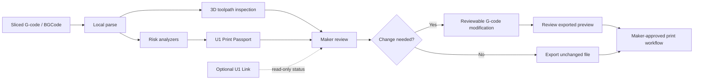
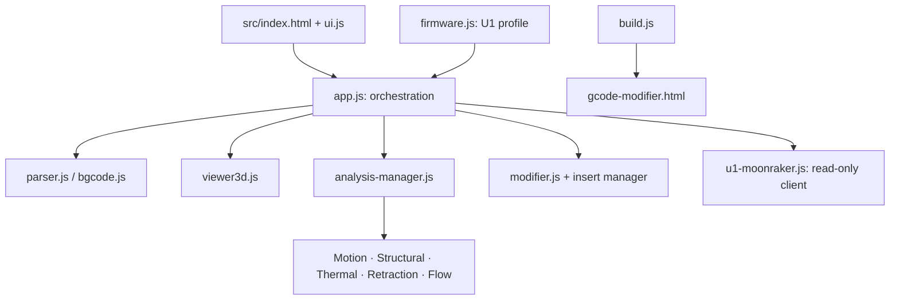

# ProofPrint U1

> **Local, explainable G-code preflight for Snapmaker U1.**

ProofPrint U1 is the evidence layer between slicing and printing. It turns the G-code that will actually drive a U1 into a visual, explainable readiness review before a maker commits material, time, and machine availability.

It is not a slicer replacement, printer firmware, cloud service, or autonomous print controller. It is a local planning and review workbench.

## Why it exists

The U1 makes ambitious multi-material work practical, but a late-discovered thermal hotspot, high-flow segment, repeated retraction, weak feature, insufficient cooling time, or poorly timed intervention can make a print expensive to recover. Slicer previews show a path. ProofPrint U1 helps makers identify the parts of that path that deserve attention before pressing print.

## Highlights

- Loads G-code and BGCode locally in the browser; the application does not upload loaded files.
- Renders toolpaths in 3D with layer playback, cross-sections, measurements, comparison tools, and heatmaps.
- Surfaces explainable motion, structural, thermal, retraction, cooling, and volumetric-flow findings.
- Produces a **U1 Print Passport** with advisory readiness score and explicit critical, warning, and informational counts.
- Provides reviewable changes including pauses, Z offsets, fan profiles, recovery helpers, custom G-code, and pressure-advance support.
- Uses a conservative U1/Klipper-safe `PAUSE` boundary rather than guessing proprietary U1 commands.
- Includes optional **U1 Link** for local, read-only Moonraker status and toolhead inspection.
- Ships as a portable single-file build with automated test coverage.

## Print-review flow



The application deliberately stops before printer control. The maker retains the final decision over every export and print.

## U1 Link: awareness without control

U1 Link defaults to `http://U1.local:7125` and uses the U1’s Moonraker-compatible local service. It makes only the following read-only requests:

| Request | Purpose |
| --- | --- |
| `GET /server/info` | Identify the local Moonraker service. |
| `GET /printer/info` | Read printer state. |
| `GET /printer/objects/query?print_stats&toolhead&extruder&extruder1&extruder2&extruder3` | Read print, homing, and available extruder-object state. |

It has no upload, G-code execution, movement, heating, print-control, configuration, or tool-change endpoint. Run through `npm start` when using U1 Link, so the app is served from `localhost`.

## Architecture



Source is modular for testing and extension, then bundled into one portable HTML artifact. Read [the architecture notes](docs/ARCHITECTURE.md) for component responsibilities and safety boundaries.

## Quick start

Prerequisite: Node.js 20+.

```bash
git clone https://github.com/shobhit1kapoor/proofprint-u1.git
cd proofprint-u1
npm install
npm test
npm run build
npm start
```

Open [http://localhost:4173](http://localhost:4173). For offline-only analysis, open `gcode-modifier.html` directly after building.

## Commands

| Command | Purpose |
| --- | --- |
| `npm test` | Run parser, modification, visual-operation, analysis, U1-profile, and read-only client tests. |
| `npm run build` | Bundle `src/` into `gcode-modifier.html`. |
| `npm start` | Serve the build at `http://localhost:4173`. |

## Responsible use

ProofPrint U1 is a planning and review tool. Findings are heuristic, and generated G-code must be reviewed against the active U1 firmware, machine configuration, material, nozzle, and slicer profile. It neither bypasses safety interlocks nor guarantees a print outcome.

## Project material

- [Final project write-up](HACKATHON_SUBMISSION.md)
- [Architecture](docs/ARCHITECTURE.md)
- [U1 local integration and acceptance protocol](docs/u1-local-integration.md)
- [Live-validation evidence record](EVIDENCE_DRAFT.md)
- [Contributing](CONTRIBUTING.md)

## License

Released under the [MIT License](LICENSE).
